<!-- HEADER SVG - animated, hosted in this repo -->
<div align="center">
  
</div>

<br/>

<div align="center">

[](https://linkedin.com/in/yashvardhandobhal)
&nbsp;
[](https://twitter.com/YashvardhanDob1)
&nbsp;
[](https://yash-bebop.github.io)
&nbsp;
[](https://linkedin.com/in/yashvardhandobhal)
&nbsp;


</div>

---

```python
profile = {
    "name"       : "Yashvardhan Dobhal",
    "aka"        : "Yash-bebop",
    "location"   : "Dehradun, Uttarakhand, India",
    "university" : "Doon University",
    "batch"      : "B.Tech CSE 2029",
    "focus"      : ["Agentic AI", "Applied ML", "Cybersecurity"],
    "currently"  : "Building agentic AI systems and LLM-powered tools",
    "ask_me"     : ["Applied AI", "Python", "TypeScript"],
    "fun_fact"   : "I think in code and dream in datasets"
}
```

---

## About

I build at the intersection of AI, product, and strategy. B.Tech CSE student at Doon University working on agentic AI systems, LLM pipelines, and applied machine learning. Beyond code, I lead product initiatives, run an AI instruction program for 60+ students across 5 countries, and compete at national and global levels in algorithmic trading and product strategy.

---

<!-- HIGHLIGHTS SVG - animated stat cards -->
<div align="center">
  
</div>

---

## Tech Stack

**Languages**


**AI / ML**


**Tools & Platforms**


**Cybersecurity**


---

<!-- LANGUAGE CHART SVG - animated bars -->
<div align="center">
  
</div>

---

## GitHub Stats

<div align="center">


&nbsp;


</div>

<div align="center">
  
</div>

---

<!-- CERTIFICATIONS SVG - animated cards -->
<div align="center">
  
</div>

---

## Featured Projects

<a href="https://github.com/Yash-bebop/AI-Driven-Public-Health-Whatsapp-and-SMS-Chatbot-for-Disease-Awareness">
  
</a>
&nbsp;
<a href="https://github.com/Yash-bebop/Quiz-System-Interface-KBC-">
  
</a>

---

## Activity

<div align="center">
  
</div>

---

<div align="center">
  
</div>

<div align="center">
  <sub><i>"code is like humor. when you have to explain it, it's bad."</i></sub>
</div>
